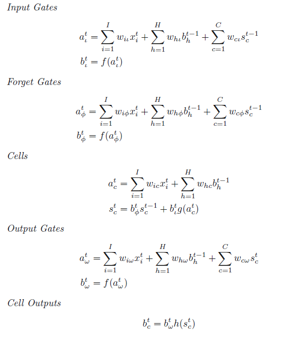
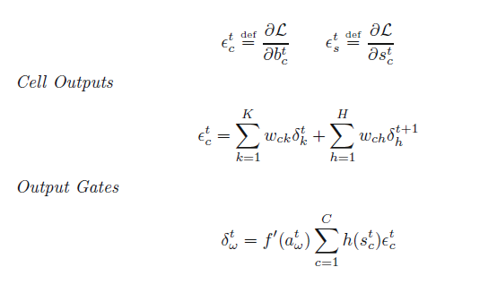
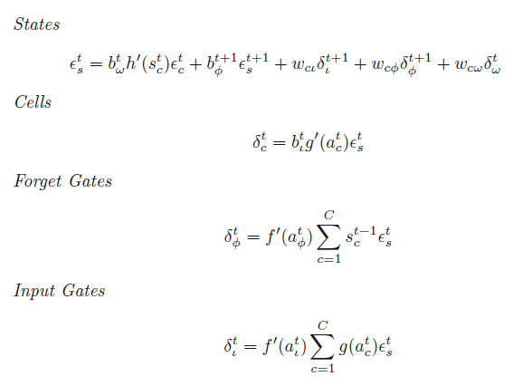

# Implementing Recurrent Neural Network from Scratch

## Reference
This project refers to [pangolulu](https://github.com/pangolulu/rnn-from-scratch).

## RNN
This branch is written by Lanpay and implement a new structure to process RNNs.

The source code is in *rnnlm2.py*, *rnn2.py*, *layer2.py*.

This implementation has serveral modifications as follows:
- Implement a new RNN layer which holds its own params like U, W and layers through time.
- Implement a new RNN unit layer which can calculate forward and backward.
- Implement the bptt algorithm with only one loop through time T.
- Implement a new Output layer.
- Using this implementation, we can define multipile rnn hidden layers.

The forward and backward process will use sequencial x and y for each rnn layer.
As we can see as follows, forward function and bptt function will both receive list parameters. 
And each xlist is a list of word of one specific sentencen.

```python
class RNNLayer(object):
    # ...
    def forward(self, xlist):
        #...

    def bptt(self, dslist):
        #...

```

## LSTM
- Implement LSTM network without peepholes.
- LSTM cell Includes an InputGate, an OutputGate, a ForgetGate.

The source code is in *rnnlm3.py*, *rnn3.py*, *layer3.py*.
The bptt algorithm of lstm is quite complicated, so it really takes time to get it through.

### LSTM BPTT
- *a* indicates cell or gate input;
- *b* indicates cell or gate output;
- *Sc* indicates cell status;
- function *f*, *g*, *h* indicates activation functions.

#### Forward


#### Backward

Output delta comes from two parts:
- delta from next layer at time t #dx(t);
- delta from this layer at time t+1 #dh(t+1);



Status delta comes from several parts:
- delta from output at time t;
- delta from status at time t+1;
- delta from input gate at time t+1;
- delta from forget gate at time t+1;
- delta from output gate at time t;



Note1: Only keep the first 2 terms if no peephole used!

Note2: The above formulars are using multiple-function, not dot-function!
Finally, when we have delta of these gates and cell, we can calculate delta of x(t) and h(t-1).
